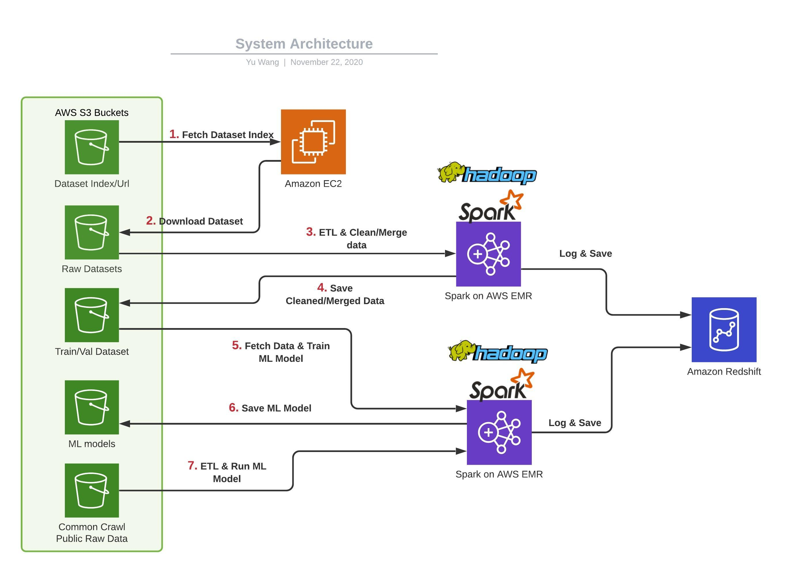

# Large Scale Sentiment Analysis NLP Pipeline

## Architecture
**Keywords: NLP/Machine Learning, Data Science/Engineering, ETL/Data Warehousing, Cloud/AWS** 


**Note**: The project is in development and is constantly evolving. Feel free to star and watch the repo.

### Overview
- **Purpose**: To build a dataset from multiple sources for NLP Sentiment Analysis Tasks and train a Machine Learning model on the newly 
built dataset. Although there exists some datasets, they are "small" (under 100MB) and "old" (2000s) and heavily focus on production/user reviews. There are very few large public datasets that focus on general Sentiment Analysis. Therefore, I decided to combine some of the few high quality datasets to produce a larger one. The final dataset will 
be a multi-domain Sentiment Analysis dataset.<br/>

- **Data Sources**: 
	1. Sentiment140. The dataset captures 1.6 million tweets where each tweet is associated with a sentiment label. The label is not produced by human annotators, but via analyzing emoticons. Total size: 200s MB.
	2. Amazon Review Data 2018. The dataset contains 200s millions of user/product reviews where each review is associated with a rating score. Total size: 30s GB.
	3. More will come as the project evolves. 

- **Contributions**:
	1. A cloud-native Data Pipeline to produce a newly dataset for general sentiment analysis.
	2. The new dataset contains 200s millions of records (where each record consists of a text and a sentiment label).
	3. A cloud-native NLP Machine Learning Pipeline that is ready to be deployed in a large-scale Spark Cluster to predict sentiment labels for texts.
	4. Fully reproducible (on your local machine and on AWS) and open source
	5. [Nearly] production-ready pipeline with scheduling and monitoring capabilities.
	6. Capable of processing TBs of data per day on AWS.

- **How to use the project:**
	1. If you are interested in Data Engineering, please focus on [Infrastructrue](#setup-infrastructure-[Local/AWS]) and Data Pipeline (prepare/processing) part.
	2. If you are interested in NLP, please focus on [Infrastructure](#setup-local-mode) and ML Pipeline part

**Note** that this is not an academic project and the main goal is not improving current state-of-the-art Sentiment Analysis results. Rather, this is a practical and 
educational project to showcase how to develop and deploy a large-scale Data/ML pipeline on AWS. Also, this is a capstone project as a graduation prerequisite for my Udacity 
Data Engineer Nanodegree but I hope it will become more.

TODOs: add links, add Common Crawl. 
TODOs: add reference <sup>superscript</sup>

### Pipeline 

### Project Structure
Project contents and file structures.
Explain what files are in this repo and what they do.

## Setup Infrastructure [Local/AWS]
Step 0. Download Datasets
Step 1. Local mode => link to section
Step 2. AWS production mode => link to section

### Download Datasets
1. Download sample datasets to local (use scripts)
2. Download complete datasets to your AWS S3 (use scripts/instructions)

### Setup Local Mode
On your own local machine (for exploration and testing) => link to section
Steps....

### Setup AWS [costly]
On AWS Environment (for large-scale deployment and production, costly) => link to section
Steps....


## How to Run [Local/AWS]

### Run Locally
how to start airflow
how to run scripts
how to monitor pipeline
how to see results

### Run on AWS [costly]


## Results

``YOUR_KEY_FILE_NAME``

```
def myfunc():
	pass
```

<br    >

### References/Links
